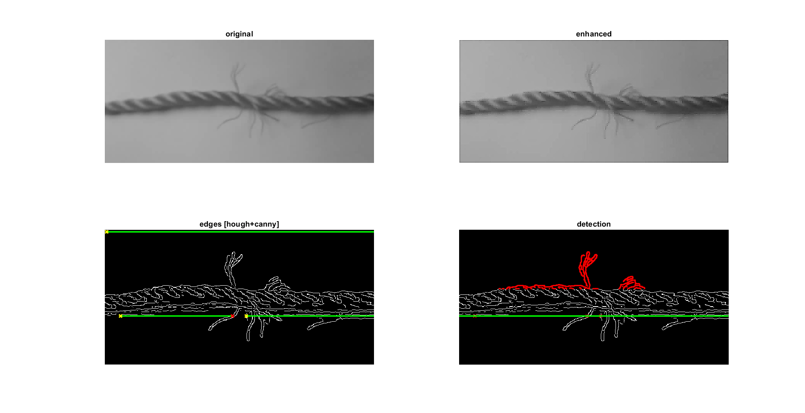

## Project developed under btech Mechatronics at Ajeenkya DY Patil university

This repository is the python client implementation that connects to the two ESP32CAM modules running as UDP servers and streams images using Requests module.

* The images are processed using opencv and its implimentation of 
    - Adaptive Gaussian Thresholding (cv2.adaptiveThreshold).
    - Canny edge detection (cv2.Canny).
    - Dilation of the edges (cv2.dilate).
    - Hough Line Transformation to detect lines (cv2.HoughLinesP).
 
# Algorithn used
```flow
Start
   |
   V
Initialize Parameters
   |
   V
Capture Image from URL
   |
   V
Convert Image to NumPy Array
   |
   V
Convert Image to Grayscale (cv.cvtColor)
   |
   V
Crop Image to Desired Height
   |
   V
Apply Filter to Image (cv.filter2D)
   |
   V
Apply Adaptive Thresholding (cv.adaptiveThreshold)
   |
   V
Perform Canny Edge Detection (cv.Canny)
   |
   V
Dilate the Edges (cv.dilate)
   |
   V
Detect Lines using Hough Line Transformation (cv.HoughLinesP)
   |
   V
Calculate Average Line Positions
   |
   V
Identify Faults Based on Thresholds
   |
   V
Log Detected Faults' Positions
   |
   V
Convert Processed Image to Texture
   |
   V
Display Image using Kivy
   |
   V
Log Frame Processing Time
   |
   V
Repeat Process for Next Frame
   |
   V
End
```

Results Achieved -
## Sample1

## Sample2

